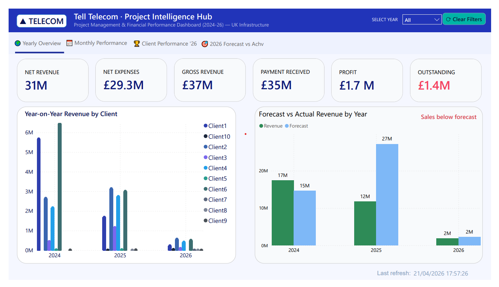
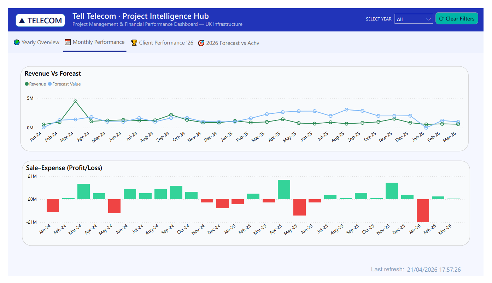
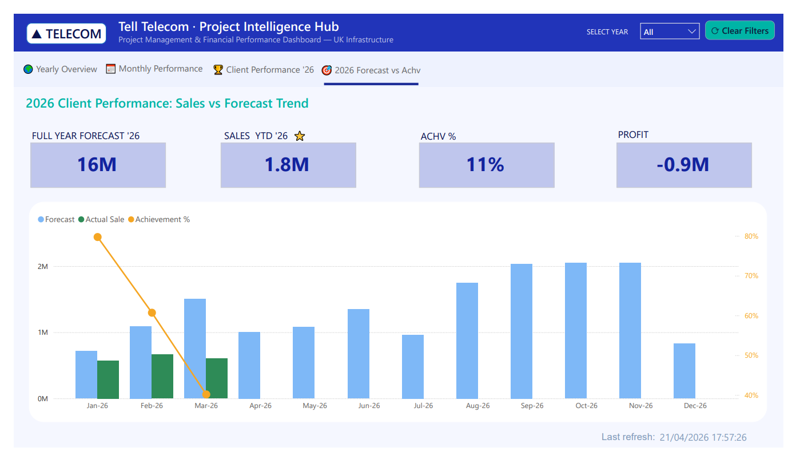

# 📡 Tell Telecom · Project Intelligence Hub

> **Project Management & Financial Performance Dashboard — UK Infrastructure**
> Built with Power BI Desktop &nbsp;|&nbsp; Industry: Telecom / UK

---

## 🖼️ Dashboard Preview

| 📅 Yearly Overview | 📈 Monthly Trend | 🔮 2026 Forecast vs Sales |
|---|---|---|
|  |  |  |

---

## 📌 Project Overview

An interactive, **multi-page Power BI dashboard** designed to give leadership a single source of truth for project performance across financial and operational metrics — covering a **3-year period (2024–2026)**.

It helps stakeholders track:

- 💰 Revenue, cost, and profitability
- 📥 Accrued vs collected income
- 🧑‍💼 Client-level performance and risk
- 🎯 Forecast accuracy and gaps

---

## 🔴 Business Problem

Even with strong revenue performance, management struggled with:

- 🌊 Limited visibility into **cash flow vs booked revenue**
- ⚠️ No **early warning signals** for forecast underperformance
- 🔍 Lack of clarity on **client-level risk and volatility**
- 📊 No **unified view** across projects, months, and financial stages

---

## ✅ Solution Delivered

This dashboard solves those issues by:

- 🗂️ Bringing all key financial metrics into **one place**
- 🚨 Highlighting **underperformance vs forecast** in real time
- 📉 Identifying **high-risk clients** through trend analysis
- 💳 Tracking **accrued (uncollected) revenue** for better cash flow decisions
- 🔎 Allowing **drill-down** from summary to detailed views

---

## 💡 Key Insights

| Metric | Value |
|---|---|
| 💷 Total Revenue | £10.50M across 7 clients |
| 📊 Profit Margin | 21% |
| 🔮 2026 Forecast Progress | Only **11%** of £16M target — ⚠️ early warning |
| 💳 Accrued Revenue | £3.04M — collection opportunity |
| ⚡ Efficiency Ratio | £1 spend → **£1.26 revenue** |
| ✅ Collection Rate | **95%** — with timing gaps |

### 📊 Client Volatility
| Client | Trend | Signal |
|---|---|---|
| Client 1 | 📈 +132% growth | 🟢 Opportunity |
| Client 6 | 📉 −77% drop | 🔴 Risk |

> Revenue has been **consistently below forecast** across 2024–2026 trend.

---

## 🗂️ Dashboard Structure (7 Tabs)

| # | Tab | Purpose |
|---|---|---|
| 1 | 💳 **Accrued Overview** | Cash flow visibility, accrued vs realised revenue |
| 2 | 🧑‍💼 **Client Performance** | Client-level trends and MoM comparison |
| 3 | 📅 **Yearly Overview** | YoY performance and forecast gap |
| 4 | 📆 **Monthly Performance** | Monthly trends and profit tracking |
| 5 | 📈 **Revenue Trends** | Long-term growth (2020–2026) |
| 6 | 📋 **Report View** | Detailed financial breakdown |
| 7 | 🎯 **Forecast vs Achievement** | 2026 tracking and risk monitoring |

---

## 🛠️ Tools & Techniques

| Tool / Technique | Usage |
|---|---|
| 📊 **Power BI Desktop** | Dashboard design & publishing |
| 🧮 **DAX** | KPI measures, MoM growth, YTD, Forecast % |
| 🔄 **Power Query** | Data cleaning and transformation |
| 🗃️ **Data Modelling** | Relational structure across datasets |
| 🎨 **Conditional Formatting** | Risk highlighting |
| 🖱️ **Interactive Filters** | Slicers and page-level navigation |

---

## 🚀 How to Use

1. **Open** the `.pbix` file in Power BI Desktop
2. **Filter** using slicers by client or year
3. **Start** with the `Yearly Overview`, then move to `Monthly` and `Client Performance`
4. **Identify risks** using the `Forecast vs Achievement` tab
5. **Drill down** using `Report View` for granular analysis

---

## 👤 About

> This project demonstrates **end-to-end analytics work** — from data preparation to insights and reporting.
>
> 🎯 *The goal is simple: help management move from reporting numbers to making better decisions.*

---

## 🔗 Connect

---

  
  
  
  

